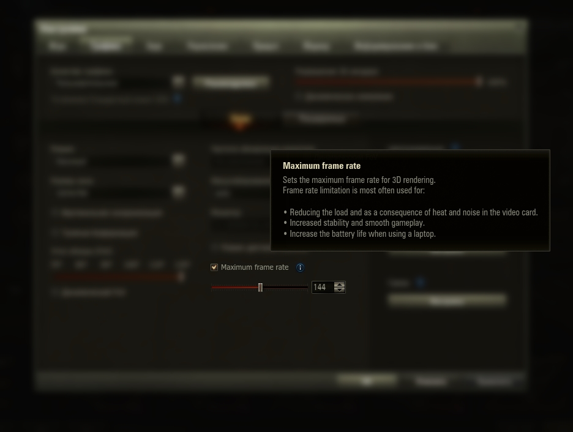

# Frames Limiter

**Frames Limiter** is a modification for the game "World Of Tanks" which allows you to cap your game FPS.  
**Frames Limiter** is based on the [XFW](https://gitlab.com/xvm/xfw) project (dependent on the native module)  

Tested for compatibility software
| Software        | x86 | x64 |
| --------------- |:---:| ---:|
| NVIDIA Overlay  |  ✅ | ✅ |
| OBS Studio      |  ✅ | ✅ |
| RTSS            |  ✅ | ✅ |
| NZXT CAM        |  ✅ | ✅ |
| Discord         |  ✅ | ✅ |
| Overwolf        |  ✅ | ✅ |
| Monosnap        |  ✅ | ✅ |
| Joxi            |  ✅ | ✅ |

### An example of new option in ingame settings
