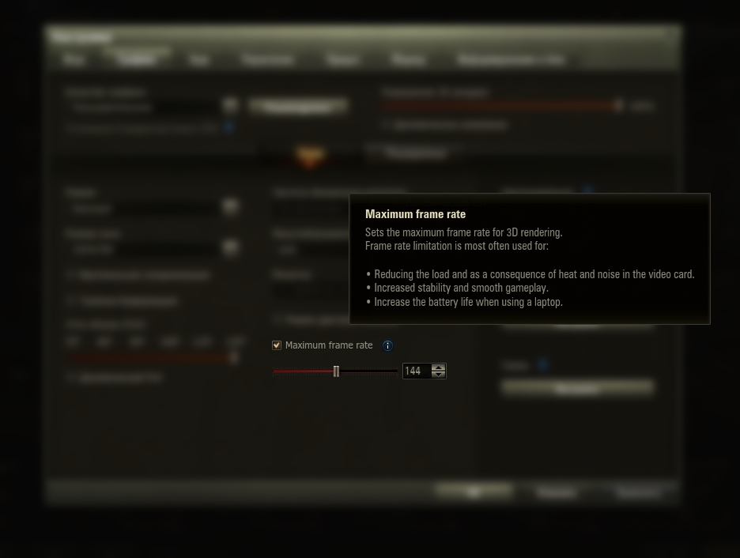

# Frames Limiter

> This project is outdated and will be archived. Its functionality is now provided by [OpenWG.Common](https://gitlab.com/openwg/wot.common). Please use that project instead.

**Frames Limiter** is a modification for the game "World Of Tanks" which allows you to cap your game FPS.

Tested for compatibility software
| Software        | x86 | x64 |
| --------------- |:---:| ---:|
| NVIDIA Overlay  |  ✅ | ✅ |
| OBS Studio      |  ✅ | ✅ |
| RTSS            |  ✅ | ✅ |
| NZXT CAM        |  ✅ | ✅ |
| Discord         |  ✅ | ✅ |
| Overwolf        |  ✅ | ✅ |
| Monosnap        |  ✅ | ✅ |
| Joxi            |  ✅ | ✅ |

### An example of new option in ingame settings

